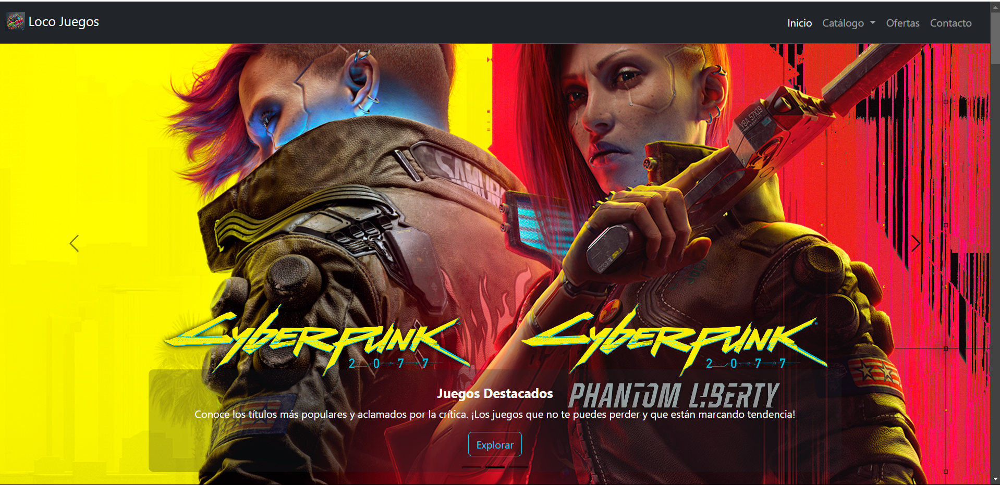

# Loco Juegos - Tienda de Videojuegos



## Descripción
Loco Juegos es un proyecto académico del curso de Diseño de Interfaces de programación que trata sobre una página web para la venta de videojuegos de cuatro plataformas: PlayStation, Xbox, Nintendo y PC. Se desarrolló utilizando diversas herramientas y habilidades adquiridas durante el curso.

## Instalación
Para ejecutar el proyecto localmente, sigue estos pasos:

1. Clona el repositorio desde GitHub:
   ```sh
   git clone https://github.com/tu_usuario/Project-Locojuegos.git
   ```
2. Accede al directorio del proyecto:
   ```sh
   cd Project-Locojuegos
   ```
3. Abre el archivo `index.html` en un navegador web.

También puedes acceder a la versión en línea a través de GitHub Pages:
[Project-Locojuegos](https://jorge-avendano.github.io/Project-Locojuegos/)

## Tecnologías principales
El proyecto utiliza las siguientes tecnologías:
- **HTML5**: Estructura de la página web.
- **CSS3**: Estilos y diseño visual.
- **Bootstrap**: Framework para diseño responsivo.
- **JavaScript**: Interactividad y funcionalidad dinámica.

## Créditos
Desarrollado como parte del curso de Diseño de Interfaces de Programación.
